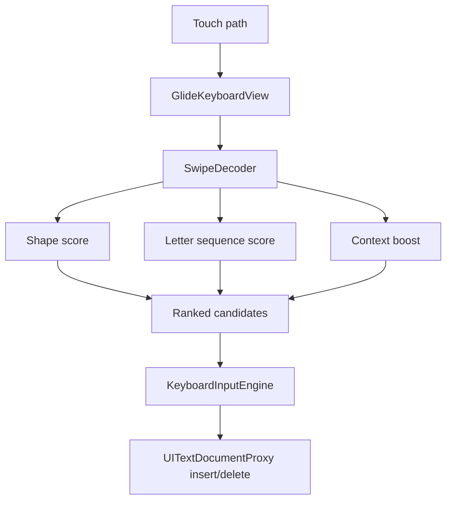

# GlideTypeAI

A privacy-first iOS custom keyboard MVP: Apple-style glide typing basics, SwiftKey-style candidate correction, and an AI rewrite control stub for future opt-in cloud/local rewriting.

## What is built

- iOS container app with setup instructions.
- Custom Keyboard Extension using `UIInputViewController`.
- Offline swipe-path decoder in pure Swift.
- Candidate bar that can replace the last swiped word.
- Smart capitalization after sentence-ending punctuation.
- Space behavior: press twice to insert `. `.
- Punctuation gestures:
  - Swipe `space` left: delete previous word.
  - Swipe `space` right: period.
  - Swipe `space` up: question mark.
  - Swipe `.` up: `?`
  - Swipe `.` right: `!`
  - Swipe `.` left: `,`
- AI rewrite button is visible but intentionally stubbed for privacy.
- `RequestsOpenAccess` is set to `false` by default.

## Requirements

- macOS with Xcode 15+
- iPhone or simulator
- XcodeGen

```bash
brew install xcodegen
```

## Run

```bash
cd GlideTypeAI
./scripts/bootstrap.sh
```

Then in Xcode:

1. Select your team under Signing & Capabilities.
2. Build and run the `GlideTypeAI` app on your iPhone.
3. Open iOS Settings → General → Keyboard → Keyboards → Add New Keyboard.
4. Add `GlideType`.
5. Open Notes/Messages and switch to the keyboard with the globe key.

## Core engine tests

The glide decoder lives in `Sources/GlideCore` as a Swift Package target. You can run:

```bash
swift test
```

If `swift test` hangs in some Linux/container environments, `swiftc -parse Sources/GlideCore/*.swift` is a quick syntax sanity check.

## Architecture



## Privacy model

The MVP is offline-first. The keyboard extension does not request open access and does not call the network. Future AI rewrite should be explicit:

1. User taps AI.
2. App explains what text will be sent.
3. User opts in.
4. Keyboard only sends selected/recent context for that action.

## Important limitation

This does not and cannot reuse Apple's private Slide-to-Type or QuickType models. It implements its own lightweight swipe decoder and input engine.
