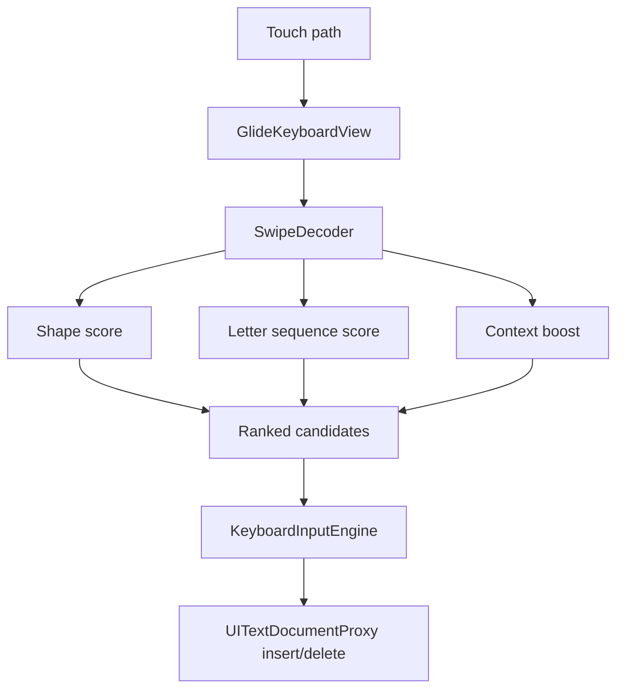

# GlideTypeAI

Privacy-first iOS custom keyboard MVP with offline glide typing, candidate correction, and an intentionally opt-in path for future AI rewriting.

## What Is Built

- iOS container app with setup flow
- Custom Keyboard Extension using `UIInputViewController`
- Offline swipe-path decoder in pure Swift
- Candidate bar for replacing the last swiped word
- Smart capitalization after sentence-ending punctuation
- Space and punctuation gestures
- AI rewrite button stubbed until explicit user consent exists
- `RequestsOpenAccess` set to `false` by default

## Why It Matters

Mobile keyboard projects sit at a difficult product boundary: privacy, latency, input ergonomics, and OS constraints all matter. This project shows an implementation that treats privacy as a system constraint instead of an afterthought.

## Architecture



## Requirements

- macOS with Xcode 15+
- iPhone or simulator
- XcodeGen

```bash
brew install xcodegen
./scripts/bootstrap.sh
```

## Tests

The decoder lives in `Sources/GlideCore` and can be checked with:

```bash
swift test
```

## Privacy Model

The MVP runs offline. The keyboard extension does not request open access and does not call the network. Any future AI rewrite flow should require explicit user action, explain what text is sent, and send only selected/recent context for that action.

## Limitation

This does not reuse Apple private Slide-to-Type or QuickType models. It implements its own lightweight swipe decoder and input engine.
